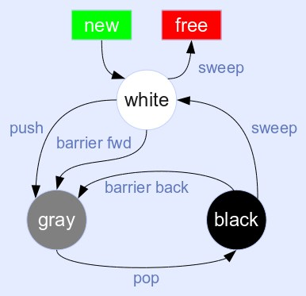

[TOC]

# 前言

已经有很多人写了gc源码分析的文章了，自己为啥还要继续写呢？最主要的原因有两个：

* 1.纯属个人需求。对于自己来说，写东西能够加深自己的理解和记忆，是个再学习的过程
* 2.看了一圈，云风系列和lichuang@github.com的系列文章比较好，已经很详细了，但是自己看的过程中还是有些问题，他们没有详细介绍，可能是觉得问题太小了，或者在他们根本不是问题。因为后面回头看来，的确不是什么问题，自己再仔细想一下或许不会有那些问题。但是，借用"勿以善小而不为，勿以恶小而为之"的意思，觉得这些小点还是值得记录下来

# 原理
mark & sweep算法，维基上的词条叫Tracing garbage collection[1].

根据名字也可以知道，最主要包括两个阶段：mark阶段和sweep阶段。

## mark阶段
这个阶段叫做扫描阶段。简单来讲，就是对于现在lua用到的所有对象进行扫描一次。如果某个对象当前跟别的对象有引用关系，那么说明他还在用；如果某个对象跟其他任何对象都没有引用关系了，说明这个对象已经没有用了。这个阶段做完，就可以知道哪些对象还有用，哪些对象不再使用了，下面就交给下一个阶段，sweep阶段。

> 注意：这里说到的引用关系，很多文章没有解释清楚，只是大概说明了一下。这里先简单介绍一下，lua的扫描阶段虽然最终是对所有对象扫描了一遍，但是并不是遍历gc链表（这个链表放了lua所有的可回收的对象），而是先把最顶层的几个节点放在一个池子（另外一个链表）里面，然后递归深入这个对象，新遍历到的对象说明有引用关系。把新遍历的对象放入池子，继续递归深入遍历，这样就等于把所有有引用关系的对象遍历了一遍，那么没有遍历过的对象就自然是跟其他任何对象都没有引用关系的了。

## sweep阶段

这个阶段做的事情其实很少，关键步骤在前一个阶段做完了。这个阶段根据前一个扫描阶段得到的结果，遍历一遍所有对象。如果这个对象已经标记为不再使用了，就会被清理掉，释放掉所在的内存；如果这个对象还在使用，那么就处理一下状态，等待下一次gc在处理。

这里说的很简单，至于扫描阶段做了什么，怎么个标记法；以及处理阶段又具体做了什么，被引用的对象，清理状态又干了什么，这些细节等待后面深入lua源码的时候再一一分析。

如果mark阶段一次性把所有节点都扫描，再一次性清理完，那么这两个步骤就都很简单了。但是，这样就有效率问题，一次性要把所有对象处理一遍，在大工程里面就绝对是一个瓶颈。所以，lua5.0以后就把gc改成了增量式的gc，主要是把标记扩展成了三种颜色，下面详细介绍一下。

## 三种颜色
三种颜色会让lua的gc，主要是扫描和清理阶段不再简单粗暴，而是一次性处理一部分，可以随时中断，下次再进来处理。三种颜色：包括白, 灰和黑。[2]

> 注意白色是有两种，后面再详细介绍。

* (1)White
表示当前对象为待访问状态,用于表示对象还没有被GC的标记过,这也是任何一个Lua对象在创建之后的初始状态,换言之,如果一个对象,在一个GC扫描过程完毕之后,仍然是白色的,那么说明该对象没有被系统中任何一个对象所引用,可以回收其空间了。也就是前面提到的，和其他对象没有引用关系，那么一次gc过程中就不会被扫描。
* (2)Gray
表示当前对象为待扫描状态,用于表示对象已经被GC访问过,但是该对象引用的其他对象还没有被访问到。这个灰色，就是后来增加的颜色，是一个中间状态。也就是这个灰色增加的状态能够让gc过程能被中断，比如某个对象递归深入扫描中间的时候，能够中断。比如一个table，扫描了部分key-value之后，还有一部分没有扫描，那么这个table就是灰色的，等下次gc进来，接着上一次的gc流程，继续扫描剩下的table部分。
* (3)Black
表示当前对象为已扫描状态,用于表示对象已经被GC访问过,并且该对象引用的其他对象也已经被访问过了。

> 这个地方提个小问题思考一下：某个对象递归深入扫描完之后，说明他肯定是黑色的，是不是就可以不管他了呢？

## 数据流

下面给出一个数据流的图[2]，详细的内容后面的章节再继续阐述。

# 参考
[1][Tracing garbage collection](https://en.wikipedia.org/wiki/Tracing_garbage_collection)

[2][ch08-GC](https://github.com/lichuang/Lua-Source-Internal/blob/master/doc/ch08-GC.md)

