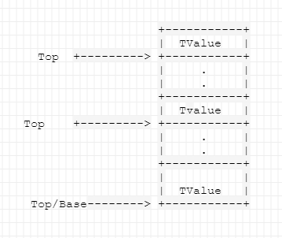
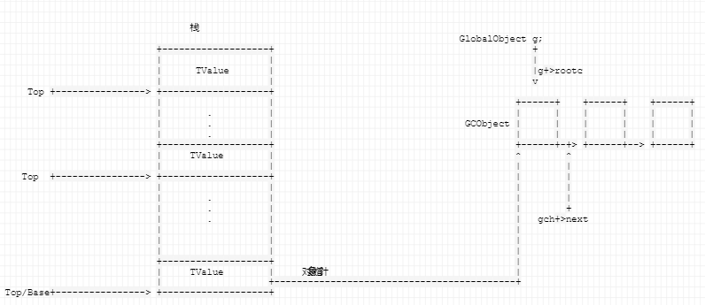

[TOC]

这是这个gc系列的第二篇，这一篇主要讲GC用到的数据结构，有助于理解gc的，所以放在前面

# 1. 栈
栈就是我们平时写代码接触最多的lua_State。在实现上是用一个数组实现的。每个成员类型是TValue，看下文详细介绍。这里不打算详细介绍栈的结构和内容，只会介绍和gc相关的一些内容，主要是帮助我们更好的理解lua的gc。

## 定义
下面是lua_State的定义，会看到栈的身影，top和base指针。

```
struct lua_State {
  CommonHeader;
  lu_byte status;
  StkId top;  /* first free slot in the stack */
  StkId base;  /* base of current function */
  global_State *l_G;
  CallInfo *ci;  /* call info for current function */
  const Instruction *savedpc;  /* `savedpc' of current function */
  StkId stack_last;  /* last free slot in the stack */
  StkId stack;  /* stack base */
  CallInfo *end_ci;  /* points after end of ci array*/
  CallInfo *base_ci;  /* array of CallInfo's */
  int stacksize;
  int size_ci;  /* size of array `base_ci' */
  unsigned short nCcalls;  /* number of nested C calls */
  lu_byte hookmask;
  lu_byte allowhook;
  int basehookcount;
  int hookcount;
  lua_Hook hook;
  TValue l_gt;  /* table of globals */
  TValue env;  /* temporary place for environments */
  GCObject *openupval;  /* list of open upvalues in this stack */
  GCObject *gclist;
  struct lua_longjmp *errorJmp;  /* current error recover point */
  ptrdiff_t errfunc;  /* current error handling function (stack index) */
};
```

## 简单的图



至于base/top和stack/stack_last、以及base_ci/end_ci之间的关系和区别就不打算详细介绍了。主要是lua的指令操作的实现，以及函数调用的时候也要用到栈，只是他们在这个数组的不同区间。

# 1.栈元素TValue
这个类型是给栈用的，前面说过栈其实是一个TValue的数组。

## 定义

```
typedef union {
  GCObject *gc;
  void *p;
  lua_Number n;
  int b;
} Value;

#define TValuefields    Value value; int tt
typedef struct lua_TValue {
  TValuefields;
} TValue;
```

## 说明
* TValue，是Value加了一个类型

类型定义：

```
/*
** basic types
*/
#define LUA_TNONE        (-1)
#define LUA_TNIL        0
#define LUA_TBOOLEAN        1
#define LUA_TLIGHTUSERDATA    2
#define LUA_TNUMBER        3
#define LUA_TSTRING        4
#define LUA_TTABLE        5
#define LUA_TFUNCTION        6
#define LUA_TUSERDATA        7
#define LUA_TTHREAD        8
```

* 可以看到存放真正值的是这是一个union结构
* 用过lua的都知道，lua是一种动态类型语言，所有值都是first-class的。所以代码层就是这个Value
* 简单介绍一下union中成员的含义

|成员|含义|
|---|---|
| GCObject *gc | 所有的需要gc的对象都是用的这个成员，所以本系列文章只关注这个成员就好了 |
| void *p | 存放lightuserdata |
| lua_Number n | 数值类型，这里也可以看出来lua里面用到的整形浮点型都是用这个存储的，就是double类型 |
| int b | bool类型 |

看代码：

```
// bool类型的宏
#define setbvalue(obj,x) \
  { TValue *i_o=(obj); i_o->value.b=(x); i_o->tt=LUA_TBOOLEAN; }
// table类型的宏
#define sethvalue(L,obj,x) \
  { TValue *i_o=(obj); \
    i_o->value.gc=cast(GCObject *, (x)); i_o->tt=LUA_TTABLE; \
    checkliveness(G(L),i_o); }
```

# GC对象
gc对象就是指lua里面需要被回收的对象，类型是在LUA_TSTRING（4）到LUA_TTHREAD（8）之间（准确来说还有扩展的类型）。开始看的时候，难免会有疑问，lua里面的所有对象不都是放在栈里面的吗？这个gc对象是个什么的存在？

## 定义

```
union GCObject {
  GCheader gch;
  union TString ts;
  union Udata u;
  union Closure cl;
  struct Table h;
  struct Proto p;
  struct UpVal uv;
  struct lua_State th;  /* thread */
};

// head
#define CommonHeader    GCObject *next; lu_byte tt; lu_byte marked
```

## 说明

* 这是一个union结构体
* **这里必须提醒注意下这个GCheader**，可以看到前面一个GCheader gch的定义，是跟类型无关的。后面在解答上面疑问的时候，一并说明一下。这个CommonHeader实现了一个链表结构(next)，也指明了这个对象的类型(tt)，以及颜色(marked)。
* 会看到除了前面的基本类型之外，多了几个可以回收的类型

```
/*
** Extra tags for non-values
*/
#define LUA_TPROTO    (LAST_TAG+1)
#define LUA_TUPVAL    (LAST_TAG+2)
#define LUA_TDEADKEY    (LAST_TAG+3)
```

# gc链表
这个链表是记录了lua里面所有的可回收对象，另外注意这是一个单向链表。正因为是单向链表，为了效率，才不会去整个遍历一遍，才会再增加扫描的链表等，这些后面详细介绍。

## 定义

这个链表的指针是放在global_State中*rootgc*中的。

```
/*
** `global state', shared by all threads of this state
*/
typedef struct global_State {
  stringtable strt;  /* hash table for strings */
  lua_Alloc frealloc;  /* function to reallocate memory */
  void *ud;         /* auxiliary data to `frealloc' */
  lu_byte currentwhite;
  lu_byte gcstate;  /* state of garbage collector */
  int sweepstrgc;  /* position of sweep in `strt' */
  GCObject *rootgc;  /* list of all collectable objects */
  GCObject **sweepgc;  /* position of sweep in `rootgc' */
  GCObject *gray;  /* list of gray objects */
  GCObject *grayagain;  /* list of objects to be traversed atomically */
  GCObject *weak;  /* list of weak tables (to be cleared) */
  GCObject *tmudata;  /* last element of list of userdata to be GC */
  Mbuffer buff;  /* temporary buffer for string concatentation */
  lu_mem GCthreshold;
  lu_mem totalbytes;  /* number of bytes currently allocated */
  lu_mem estimate;  /* an estimate of number of bytes actually in use */
  lu_mem gcdept;  /* how much GC is `behind schedule' */
  int gcpause;  /* size of pause between successive GCs */
  int gcstepmul;  /* GC `granularity' */
  lua_CFunction panic;  /* to be called in unprotected errors */
  TValue l_registry;
  struct lua_State *mainthread;
  UpVal uvhead;  /* head of double-linked list of all open upvalues */
  struct Table *mt[NUM_TAGS];  /* metatables for basic types */
  TString *tmname[TM_N];  /* array with tag-method names */
} global_State;
```

这个结构放了所有关于gc的内容(对着后面的注释看一下)：

* currentwhite：这个就是[第一篇]()中提到的gc流程中的当前白色，如果清理阶段某个对象是otherwhite，那么他就会被清理掉
* gcstate：控制gc流程的，后面流程中说的状态就是记录在这里
* rootgc：前面刚提到过，所有可回收的gc对象单向链表
* gray：为了gc的效率增加的一个gc链表
* grayagain：为了实现增量式gc，过程中处理中断问题的一个链表
* GCthreshold，totalbytes，estimate，gcdept，gcpause：这几个单次gc相关的控制或者状态量，直接关系到lua提供的接口*collectgarbage*
* 另外一些是全局的一些变量的定义，metatable等。这些跟gc扫描不会遍历整个gc链表有关系。

# 栈和gc链表的关系
栈没有细说，但是他和gc链表的关系必须详细说明一下。如下图所示



## 答疑解惑
就着问题，说一下栈和gc链表之间的关系。

* 1.GCObject的存在

这里就需要了解gc链表和栈中元素的关系。lua的栈是一个数组，里面真正存放了lua里面的所有对象。gc链表存放了lua所有的可回收对象，而事实上gc链表存放的只是所有可回收对象的指针，真正的对象还是以TValue（GCObject* gc成员）的形式放在lua栈中的。当然，对象真正的内容是在堆上（需要自己回收）。而栈和gc链表中存在的只是真实对象的指针，不同类型的结构不一样，所以以这种方式才能存在一起管理

* 2.怎么做到的？

前面提到了CommonHead，它在栈和gc链表关系中起了关键的作用。有相同的头部，所以可以通过强制转换在TValue和GCObject直接为了当时需要进行切换.看源码更清晰了，能够转换为GCObject的结构体都是必须包含这个头部的，需要GC的结构都要添加这个头部，如下所所示：

```
//
struct lua_State {
  CommonHeader;

//
typedef struct Table {
  CommonHeader;

// 
typedef struct UpVal {
  CommonHeader;

//
typedef struct Proto {
  CommonHeader;

//
typedef union Udata {
  L_Umaxalign dummy;  /* ensures maximum alignment for `local' udata */
  struct {
    CommonHeader;

typedef union TString {
  L_Umaxalign dummy;  /* ensures maximum alignment for strings */
  struct {
    CommonHeader;
```

# 总结
* 这里并没有把所有的结构体都解释一遍，userdata，upvalue相关的都是比较细节的东西，可以单独看相关的内容，在全局理解的情况下根据自身特性去看也会很容易明白
